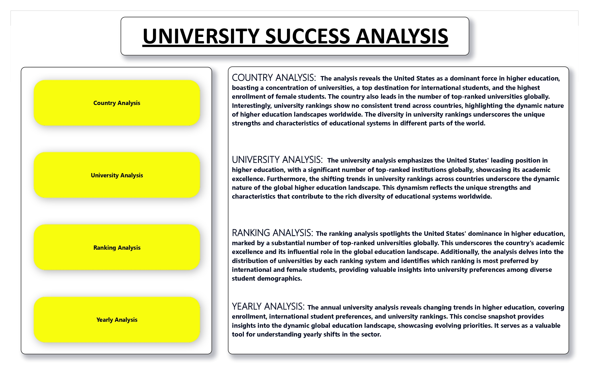
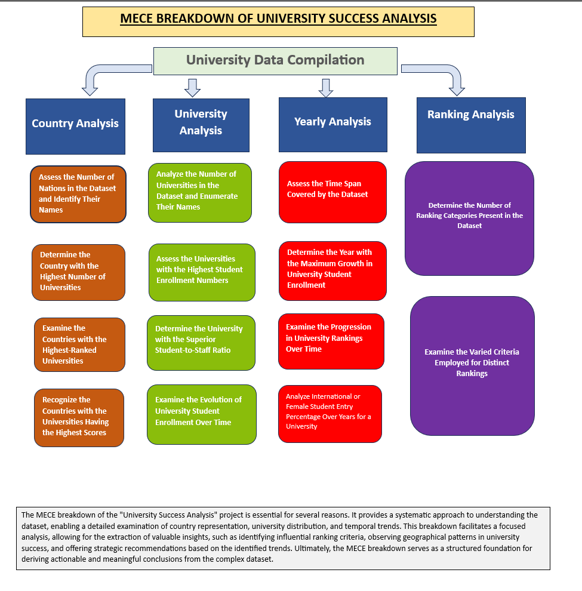
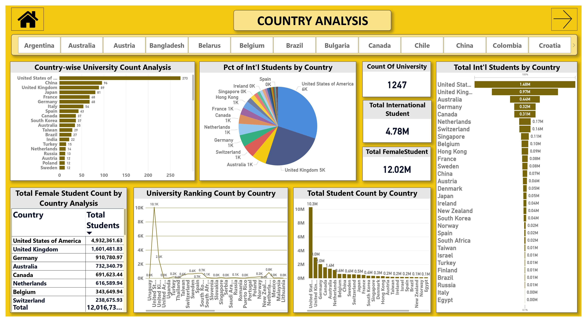
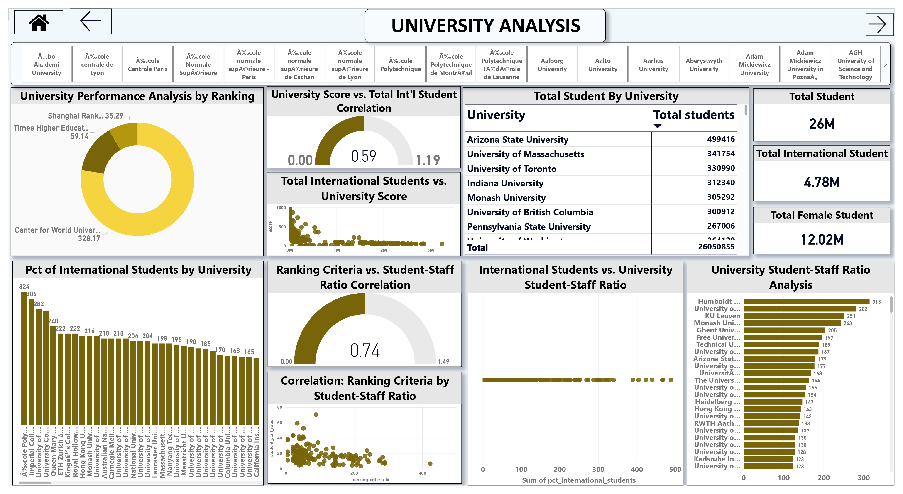
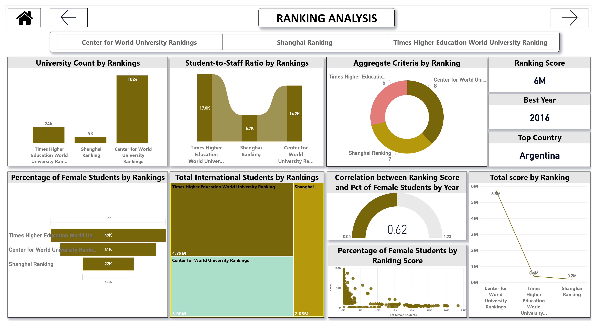
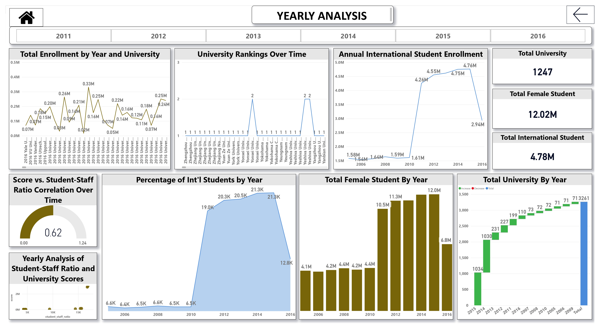

# 🎓 Global Universities Success Analysis

> A comprehensive data analytics project exploring university performance through interactive visualizations and statistical analysis



## 📋 Table of Contents
- [Overview](#overview)
- [Key Features](#key-features)
- [Project Structure](#project-structure)
- [Data Architecture](#data-architecture)
- [Analysis Framework](#analysis-framework)
- [Dashboards & Visualizations](#dashboards--visualizations)
- [Getting Started](#getting-started)
- [Technologies Used](#technologies-used)
- [Contributing](#contributing)

## 🎯 Overview

This project presents a comprehensive analysis of global university performance using multiple ranking systems and criteria. By leveraging **Power BI**, **SQL**, and **Excel**, we've created an integrated solution that provides actionable insights into factors influencing university success worldwide.

### 🎯 Project Objectives

- **📊 Compare University Rankings** across different ranking systems
- **🔍 Identify Key Performance Indicators** that influence university success
- **🌍 Conduct Regional Analysis** to understand geographical patterns
- **📈 Analyze Temporal Trends** in university performance over time
- **🔗 Perform Correlation Analysis** between various ranking criteria
- **📱 Create Interactive Dashboards** for data exploration
- **🤖 Implement Predictive Models** for future performance forecasting

## ✨ Key Features

- **Multi-dimensional Analysis**: Comprehensive evaluation across countries, universities, ranking systems, and time periods
- **Interactive Dashboards**: Four specialized Power BI dashboards for different analytical perspectives
- **MECE Framework**: Structured approach ensuring mutually exclusive and collectively exhaustive analysis
- **Rich Data Visualization**: Clear, intuitive charts and graphs for complex data interpretation
- **Temporal Analysis**: Track university performance changes over multiple years

## 📁 Project Structure

```
Global Universities Success Analysis/
├── 📊 Global_Univ_Analysis.pbix     # Main Power BI file
├── 📸 assets/                       # Visual assets and screenshots
│   ├── overview.jpg
│   ├── country_analysis.jpg
│   ├── university_analysis.jpg
│   ├── ranking_analysis.jpg
│   ├── yearly_analysis.jpg
│   └── mece.png
├── 📁 data/
│   ├── csv/                         # Source data files
│   │   ├── country.csv
│   │   ├── university.csv
│   │   ├── ranking_system.csv
│   │   ├── ranking_criteria.csv
│   │   ├── university_year.csv
│   │   └── university_ranking_year.csv
│   └── sql/                         # SQL scripts for data processing
└── 📄 README.md                     # Project documentation
```

## 🏗️ Data Architecture

Our dataset is structured around six core entities that form a comprehensive university ranking ecosystem:

### 📊 Core Data Tables

| Table | Description | Key Fields |
|-------|-------------|------------|
| **Country** | Geographic entities | `country_id`, `country_name` |
| **University** | Educational institutions | `university_id`, `university_name`, `country_id` |
| **Ranking System** | Different ranking methodologies | `system_id`, `system_name` |
| **Ranking Criteria** | Evaluation parameters | `criteria_id`, `system_id`, `criteria_name` |
| **University Year** | Annual university metrics | `university_id`, `year`, `num_students`, `pct_international_students` |
| **University Ranking Year** | Performance scores | `university_id`, `criteria_id`, `year`, `score` |

### 🔄 MECE Analysis Framework



Our analysis follows the **Mutually Exclusive, Collectively Exhaustive (MECE)** framework, ensuring:
- **Mutually Exclusive**: Each analysis dimension is distinct and non-overlapping
- **Collectively Exhaustive**: All relevant aspects of university performance are covered
- **Structured Approach**: Systematic breakdown of complex data relationships

## 📊 Dashboards & Visualizations

### 🌍 1. Country Analysis Dashboard
Explore university performance patterns across different countries and regions.



**Key Insights:**
- Regional performance comparisons
- Country-wise university distribution
- International ranking trends by geography

---

### 🏛️ 2. University Analysis Dashboard
Deep dive into individual university performance and comparative analysis.



**Features:**
- Individual university performance tracking
- Peer comparison capabilities
- Performance trend analysis over time

---

### 📈 3. Ranking System Analysis Dashboard
Compare and contrast different ranking methodologies and their impacts.



**Analysis Points:**
- Cross-ranking system comparisons
- Methodology impact assessment
- Criteria weight analysis

---

### 📅 4. Yearly Analysis Dashboard
Temporal analysis showing how university metrics evolve over time.



**Time-based Insights:**
- Year-over-year performance changes
- Trend identification and forecasting
- Historical performance patterns

## 🚀 Getting Started

### Prerequisites
- **Power BI Desktop** (latest version)
- **Microsoft Excel** (2016 or later)
- **SQL Server** or compatible database system (optional)

### Installation & Setup

1. **Clone the Repository**
   ```bash
   git clone https://github.com/your-username/Global-Universities-Success-Analysis.git
   cd Global-Universities-Success-Analysis
   ```

2. **Open Power BI Analysis**
   - Launch Power BI Desktop
   - Open `Global_Univ_Analysis.pbix`
   - Refresh data connections if needed

3. **Explore the Data**
   - Navigate through the four main dashboards
   - Use filters and slicers for interactive analysis
   - Export insights as needed

### 📖 Usage Guide

1. **Start with Overview**: Begin with the Country Analysis dashboard for a high-level perspective
2. **Drill Down**: Use University Analysis for detailed institutional insights
3. **Compare Systems**: Leverage Ranking Analysis to understand methodology differences
4. **Track Trends**: Use Yearly Analysis for temporal pattern identification

## 🛠️ Technologies Used

| Technology | Purpose | Version |
|------------|---------|---------|
| **Power BI** | Data visualization and dashboards | Latest |
| **Microsoft Excel** | Data preprocessing and EDA | 2016+ |
| **SQL** | Data querying and transformation | Various |
| **CSV** | Data storage format | - |

## 📈 Analysis Methodology

### 1. **Data Collection & Preparation**
- Aggregated data from multiple university ranking sources
- Cleaned and normalized data for consistency
- Established relational data model

### 2. **Exploratory Data Analysis (EDA)**
- Statistical analysis of key metrics
- Correlation analysis between variables
- Pattern identification across dimensions

### 3. **Visualization Development**
- Created interactive Power BI dashboards
- Implemented dynamic filtering and drill-down capabilities
- Designed user-friendly interface for data exploration

### 4. **Insights Generation**
- Identified key performance drivers
- Discovered regional and temporal patterns
- Generated actionable recommendations

## 🤝 Contributing

We welcome contributions to improve this analysis! Here's how you can help:

### 🔧 Ways to Contribute
- **Data Enhancement**: Add new ranking systems or update existing data
- **Visualization Improvements**: Enhance dashboard designs or add new charts
- **Analysis Extensions**: Implement additional analytical methods
- **Documentation**: Improve project documentation and guides

### 📝 Contribution Process
1. Fork the repository
2. Create a feature branch (`git checkout -b feature/AmazingFeature`)
3. Commit your changes (`git commit -m 'Add some AmazingFeature'`)
4. Push to the branch (`git push origin feature/AmazingFeature`)
5. Open a Pull Request

## 📄 License

This project is licensed under the MIT License - see the [LICENSE](LICENSE) file for details.

## 📞 Contact & Support

- **Email**: ayushpremrocks@gmail.com
- **LinkedIn**: [Your LinkedIn Profile](https://linkedin.com/in/ayushpremrocks)
- **Issues**: [GitHub Issues](https://github.com/ayushpremrocks/Global-Universities-Success-Analysis/issues)

---
"# Global-Universities-Success-Analysis" 
